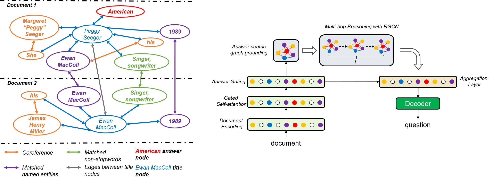

# Multi-hop NQG
This repository contains code and models for the paper: [Asking Complex Questions with Multi-hop Answer-focused Reasoning](https://arxiv.org/pdf/2009.07402.pdf)


#### Data Preprocessing
1. The raw dataset can be found in train/dev/test_data.pkl at https://drive.google.com/drive/folders/16xLrGN2R9OXop4G5pVGfjmqUyhxPVn-P?usp=sharing
2. The preprocessed dataset and grounded entity graph can be found in pp_train/dev/test_data.pkl at https://drive.google.com/drive/folders/16xLrGN2R9OXop4G5pVGfjmqUyhxPVn-P?usp=sharing

# CODE 
The code will be released after approval.


## Citation
```
    
```

